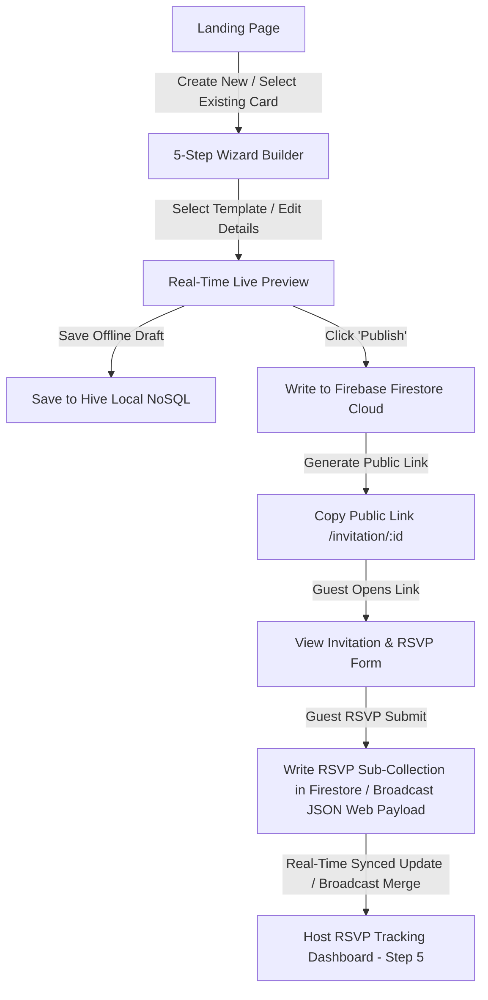

# IMP

# Project Context: Digital Wedding Invitation Builder (V5 - Local & Cloud Real-Time Sync)

An elegant, modern, responsive cross-platform Flutter Web and Mobile application that empowers couples to create, customize, preview, publish, and track high-quality digital wedding invitations in real-time.

---

## 🎯 Project Purpose

In the digital era, printed wedding invitations are increasingly being complemented or replaced by highly interactive, instant, and eco-friendly digital invitations. 
The **Digital Wedding Invitation Builder** is designed to provide an easy-to-use self-service platform where users can type in their wedding details, select a beautifully pre-designed cultural theme, preview it in real-time, export it as a high-resolution PNG image, publish it to a shareable web link, and **track guest RSVP confirmations in real-time** across different devices.

---

## 👥 Target Users

1. **Couples & Planners**: Looking for a premium, fast, and elegant way to create wedding invitations and track guest lists.
2. **Guests**: Receiving a digital invitation link that displays beautifully on any device (mobile, tablet, desktop) and confirming their RSVPs in 1 click.
3. **Design Hosts**: Who want high-quality ethnic-focused layouts (Classic Gold & Red, Royal Maroon, Elegant Rose Gold, and Maharaja Emerald) without needing complex design software.

---

## ✨ Key Features (Enterprise Version)

* **Premium Landing Page**: A responsive, welcoming page inspired by modern Indian wedding themes (Gold, Red, and Navy colors) with a clean Call-To-Action (CTA) to start building and an **Active Invitations Registry panel** that lists your saved drafts with quick shortcuts.
* **5-Step Wizard Builder**: An easy-to-use multi-step wizard form to enter essential wedding details and review metrics:
  1. *Step 1*: Design Template Selection
  2. *Step 2*: Couple details (Bride, Groom, Message)
  3. *Step 3*: Logistics schedules (Pickers for Date/Time, inputs for Venue)
  4. *Step 4*: Review & Export (Generate URL, download PNG)
  5. *Step 5*: Real-time Host RSVP Dashboard
* **Live Dynamic Preview & Remote Templates**: A side-by-side (or toggleable on mobile) real-time interactive rendering of the selected card template. Fetches templates dynamically from a remote preset API, including a **4th Maharaja Jaipur Emerald & Gold** dynamic theme with runtime Google Fonts and network overlays.
* **High-Res Export**: Download invitation as a 1080x1920 PNG image using `screenshot`.
* **Hive Offline Cache (Local Database)**: High-performance NoSQL local-first database to save offline drafts and local configurations, retaining drafts until published.
* **Dual-Storage Persistence Pipeline**: Auto-saves local drafts to Hive on keypresses and publishes finalized invites to Firebase Firestore.
* **Distributed Local Real-Time Sync**: A state-of-the-art native HTML5 `BroadcastChannel` local sync system. When testing locally across multiple browser tabs/windows, guest RSVP submissions in Tab B broadcast rich JSON payloads that are instantly merged into Tab A's Hive box in-memory cache, updating the dashboard in real-time with **zero browser refreshes**!
* **Global Cloud Real-Time Sync**: Listeners hooked to live Firestore snapshot streams that update your host dashboard reactively when guests submit RSVPs from their mobile phones over the internet.

---

## 🗺️ User Flow & Architecture Sync

1. **Step 1: Explore & Launch**: User lands on the landing page, creates a new card, or selects an existing saved invitation from their ledger.
2. **Step 2: Input Details (Multi-Step Wizard)**: User selects a template theme (static or remote-injected), enters couple details, and schedules event times.
3. **Step 3: Publish to Cloud**: User clicks **Generate Link** which publishes the invitation object from **Hive (Local)** to **Firebase Firestore (Cloud)**.
4. **Step 4: Share & Collect RSVPs**: The public URL `/invitation/:uuid` is copied. Guests visit the URL, view the card, and confirm their attendance.
5. **Step 5: Monitor Headcount**: The host monitors real-time guest tallies, dietary statistics, and lists in the dashboard (Step 5) with zero refreshes required, powered by the local BroadcastChannel bridge or public Firestore snapshots.

