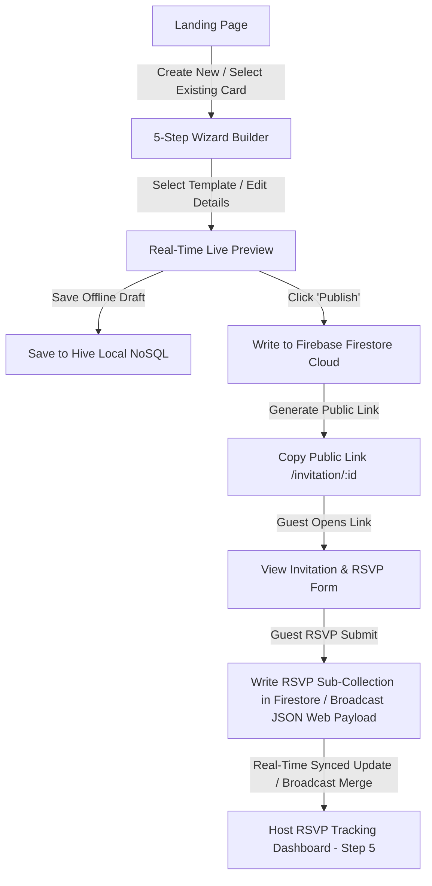

# IMP Documentation

# Project Context: Digital Wedding Invitation Builder (V5 - Local & Cloud Real-Time Sync)

An elegant, modern, responsive cross-platform Flutter Web and Mobile application that empowers couples to create, customize, preview, publish, and track high-quality digital wedding invitations in real-time.

---

## 🎯 Project Purpose

In the digital era, printed wedding invitations are increasingly being complemented or replaced by highly interactive, instant, and eco-friendly digital invitations. 
The **Digital Wedding Invitation Builder** is designed to provide an easy-to-use self-service platform where users can type in their wedding details, select a beautifully pre-designed cultural theme, preview it in real-time, export it as a high-resolution PNG image, publish it to a shareable web link, and **track guest RSVP confirmations in real-time** across different devices.

---

## 👥 Target Users

1. **Couples & Planners**: Looking for a premium, fast, and elegant way to create wedding invitations and track guest lists.
2. **Guests**: Receiving a digital invitation link that displays beautifully on any device (mobile, tablet, desktop) and confirming their RSVPs in 1 click.
3. **Design Hosts**: Who want high-quality ethnic-focused layouts (Classic Gold & Red, Royal Maroon, Elegant Rose Gold, and Maharaja Emerald) without needing complex design software.

---

## ✨ Key Features (Enterprise Version)

* **Premium Landing Page**: A responsive, welcoming page inspired by modern Indian wedding themes (Gold, Red, and Navy colors) with a clean Call-To-Action (CTA) to start building and an **Active Invitations Registry panel** that lists your saved drafts with quick shortcuts.
* **5-Step Wizard Builder**: An easy-to-use multi-st ep wizard form to enter essential wedding details and review metrics:
  1. *Step 1*: Design Template Selection
  2. *Step 2*: Couple details (Bride, Groom, Message)
  3. *Step 3*: Logistics schedules (Pickers for Date/Time, inputs for Venue)
  4. *Step 4*: Review & Export (Generate URL, download PNG)
  5. *Step 5*: Real-time Host RSVP Dashboard
* **Live Dynamic Preview & Remote Templates**: A side-by-side (or toggleable on mobile) real-time interactive rendering of the selected card template. Fetches templates dynamically from a remote preset API, including a **4th Maharaja Jaipur Emerald & Gold** dynamic theme with runtime Google Fonts and network overlays.
* **High-Res Export**: Download invitation as a 1080x1920 PNG image using `screenshot`.
* **Hive Offline Cache (Local Database)**: High-performance NoSQL local-first database to save offline drafts and local configurations, retaining drafts until published.
* **Dual-Storage Persistence Pipeline**: Auto-saves local drafts to Hive on keypresses and publishes finalized invites to Firebase Firestore.
* **Distributed Local Real-Time Sync**: A state-of-the-art native HTML5 `BroadcastChannel` local sync system. When testing locally across multiple browser tabs/windows, guest RSVP submissions in Tab B broadcast rich JSON payloads that are instantly merged into Tab A's Hive box in-memory cache, updating the dashboard in real-time with **zero browser refreshes**!
* **Global Cloud Real-Time Sync**: Listeners hooked to live Firestore snapshot streams that update your host dashboard reactively when guests submit RSVPs from their mobile phones over the internet.

---

## 🗺️ User Flow & Architecture Sync

1. **Step 1: Explore & Launch**: User lands on the landing page, creates a new card, or selects an existing saved invitation from their ledger.
2. **Step 2: Input Details (Multi-Step Wizard)**: User selects a template theme (static or remote-injected), enters couple details, and schedules event times.
3. **Step 3: Publish to Cloud**: User clicks **Generate Link** which publishes the invitation object from **Hive (Local)** to **Firebase Firestore (Cloud)**.
4. **Step 4: Share & Collect RSVPs**: The public URL `/invitation/:uuid` is copied. Guests visit the URL, view the card, and confirm their attendance.
5. **Step 5: Monitor Headcount**: The host monitors real-time guest tallies, dietary statistics, and lists in the dashboard (Step 5) with zero refreshes required, powered by the local BroadcastChannel bridge or public Firestore snapshots.

## New Update

- Created [rule.md](file:///d:/User/Projects/new_project_23-5-26/rule.md) to store the official project rules including architectural guidelines, context documentation standards, and development workflows.
- Updated [rule.md](file:///d:/User/Projects/new_project_23-5-26/rule.md) to append additional design guidelines, target collections, color palettes, and UI/UX improvement standards.
- Implemented premium UI/UX enhancements across the Landing Page, Wizard Builder, and Guest RSVP Views.
- Expanded the remote-injected templates catalog from 4 to 15 premium cards categorized under the Royal, Luxury, Floral, and Modern Collections.
- Added custom circular swatches representing primary/secondary palettes and category badges inside the builder's theme selector.
- Injected a vector-based circular and arch-like inner gold corner details (`GoldCornerPainter`) into all dynamic invitation cards.

## New Update

- Standardized the layout canvas of all key templates (`GoldRedMandalaTemplate`, `MaroonPeacockTemplate`, `RoseGoldFloralTemplate`, and `DynamicTemplateWidget`) by wrapping their build outputs in a `FittedBox` + `SizedBox` (360x640, 9:16 aspect ratio).
- Fixed the RenderFlex vertical overflow layout exceptions on the Landing Page Hero cards stack and Builder preview views across different browser/device viewport dimensions.

## New Update

- Resolved compile-time type assignment conflicts in component themed data (`CardTheme` to `CardThemeData` transition).
- Added full `fontStyle` customization mapping to standard typography components (`AppTitle`, `AppHeading`, and `AppBody`).
- Rectified invalid constant values inside `AppTextField` borders referencing dynamic style tokens.
- Restored code analysis health, resolving static analysis issues and resolving explicit project dependencies in `pubspec.yaml`.

## New Update

- Migrated the application container, panels, inputs, and RSVP dashboards to a premium light SaaS theme while keeping the wedding invitation card templates themselves as the colorful focus.
# IMP

# Project Context: Digital Wedding Invitation Builder (V5 - Local & Cloud Real-Time Sync)

An elegant, modern, responsive cross-platform Flutter Web and Mobile application that empowers couples to create, customize, preview, publish, and track high-quality digital wedding invitations in real-time.

---

## 🎯 Project Purpose

In the digital era, printed wedding invitations are increasingly being complemented or replaced by highly interactive, instant, and eco-friendly digital invitations. 
The **Digital Wedding Invitation Builder** is designed to provide an easy-to-use self-service platform where users can type in their wedding details, select a beautifully pre-designed cultural theme, preview it in real-time, export it as a high-resolution PNG image, publish it to a shareable web link, and **track guest RSVP confirmations in real-time** across different devices.

---

## 👥 Target Users

1. **Couples & Planners**: Looking for a premium, fast, and elegant way to create wedding invitations and track guest lists.
2. **Guests**: Receiving a digital invitation link that displays beautifully on any device (mobile, tablet, desktop) and confirming their RSVPs in 1 click.
3. **Design Hosts**: Who want high-quality ethnic-focused layouts (Classic Gold & Red, Royal Maroon, Elegant Rose Gold, and Maharaja Emerald) without needing complex design software.

---

## ✨ Key Features (Enterprise Version)

* **Premium Landing Page**: A responsive, welcoming page inspired by modern Indian wedding themes (Gold, Red, and Navy colors) with a clean Call-To-Action (CTA) to start building and an **Active Invitations Registry panel** that lists your saved drafts with quick shortcuts.
* **5-Step Wizard Builder**: An easy-to-use multi-st ep wizard form to enter essential wedding details and review metrics:
  1. *Step 1*: Design Template Selection
  2. *Step 2*: Couple details (Bride, Groom, Message)
  3. *Step 3*: Logistics schedules (Pickers for Date/Time, inputs for Venue)
  4. *Step 4*: Review & Export (Generate URL, download PNG)
  5. *Step 5*: Real-time Host RSVP Dashboard
* **Live Dynamic Preview & Remote Templates**: A side-by-side (or toggleable on mobile) real-time interactive rendering of the selected card template. Fetches templates dynamically from a remote preset API, including a **4th Maharaja Jaipur Emerald & Gold** dynamic theme with runtime Google Fonts and network overlays.
* **High-Res Export**: Download invitation as a 1080x1920 PNG image using `screenshot`.
* **Hive Offline Cache (Local Database)**: High-performance NoSQL local-first database to save offline drafts and local configurations, retaining drafts until published.
* **Dual-Storage Persistence Pipeline**: Auto-saves local drafts to Hive on keypresses and publishes finalized invites to Firebase Firestore.
* **Distributed Local Real-Time Sync**: A state-of-the-art native HTML5 `BroadcastChannel` local sync system. When testing locally across multiple browser tabs/windows, guest RSVP submissions in Tab B broadcast rich JSON payloads that are instantly merged into Tab A's Hive box in-memory cache, updating the dashboard in real-time with **zero browser refreshes**!
* **Global Cloud Real-Time Sync**: Listeners hooked to live Firestore snapshot streams that update your host dashboard reactively when guests submit RSVPs from their mobile phones over the internet.

---

## 🗺️ User Flow & Architecture Sync

1. **Step 1: Explore & Launch**: User lands on the landing page, creates a new card, or selects an existing saved invitation from their ledger.
2. **Step 2: Input Details (Multi-Step Wizard)**: User selects a template theme (static or remote-injected), enters couple details, and schedules event times.
3. **Step 3: Publish to Cloud**: User clicks **Generate Link** which publishes the invitation object from **Hive (Local)** to **Firebase Firestore (Cloud)**.
4. **Step 4: Share & Collect RSVPs**: The public URL `/invitation/:uuid` is copied. Guests visit the URL, view the card, and confirm their attendance.
5. **Step 5: Monitor Headcount**: The host monitors real-time guest tallies, dietary statistics, and lists in the dashboard (Step 5) with zero refreshes required, powered by the local BroadcastChannel bridge or public Firestore snapshots.

## New Update

- Created [rule.md](file:///d:/User/Projects/new_project_23-5-26/rule.md) to store the official project rules including architectural guidelines, context documentation standards, and development workflows.
- Updated [rule.md](file:///d:/User/Projects/new_project_23-5-26/rule.md) to append additional design guidelines, target collections, color palettes, and UI/UX improvement standards.
- Implemented premium UI/UX enhancements across the Landing Page, Wizard Builder, and Guest RSVP Views.
- Expanded the remote-injected templates catalog from 4 to 15 premium cards categorized under the Royal, Luxury, Floral, and Modern Collections.
- Added custom circular swatches representing primary/secondary palettes and category badges inside the builder's theme selector.
- Injected a vector-based circular and arch-like inner gold corner details (`GoldCornerPainter`) into all dynamic invitation cards.

## New Update

- Standardized the layout canvas of all key templates (`GoldRedMandalaTemplate`, `MaroonPeacockTemplate`, `RoseGoldFloralTemplate`, and `DynamicTemplateWidget`) by wrapping their build outputs in a `FittedBox` + `SizedBox` (360x640, 9:16 aspect ratio).
- Fixed the RenderFlex vertical overflow layout exceptions on the Landing Page Hero cards stack and Builder preview views across different browser/device viewport dimensions.

## New Update

- Resolved compile-time type assignment conflicts in component themed data (`CardTheme` to `CardThemeData` transition).
- Added full `fontStyle` customization mapping to standard typography components (`AppTitle`, `AppHeading`, and `AppBody`).
- Rectified invalid constant values inside `AppTextField` borders referencing dynamic style tokens.
- Restored code analysis health, resolving static analysis issues and resolving explicit project dependencies in `pubspec.yaml`.

## New Update

- Migrated the application container, panels, inputs, and RSVP dashboards to a premium light SaaS theme while keeping the wedding invitation card templates themselves as the colorful focus.
- Resolved a global card border centering bug across all templates (Gold Red Mandala, Royal Peacock, Rose Gold Floral, and remote dynamic templates) by wrapping the outer gold borders in `Positioned.fill` inside the cards' stacks.
- Re-architected the landing view template grid to use a `CustomScrollView` and a `SliverGrid`, enabling true lazy loading and scroll-triggered fade/scale staggered animations.
- Redesigned the 5-step wizard workspace indicator stepper to display a clean light SaaS path with green checkmarks for completed steps, gold for active step, and light gray for future steps.
- Polished the guest RSVP sheet and host tracking dashboard to look clean and highly readable under the light theme.
- Fixed undefined `isLight` variable scope compile errors in `builder_view.dart` inside the event logistics form methods.
- Resolved the double-shadow visualization issue on the live preview page by removing the redundant, dark outer container shadow wrapping the preview card.
- Centered dynamic remote templates (such as Rajputana Crimson & Gold) horizontally by wrapping their inner content column in a `Positioned.fill` widget within the stack.

## New Update

- Re-architected `ScrollEntrance` visibility tracking to register scroll position listeners on the nearest `Scrollable` ancestor, executing entrance animations dynamically exactly once when components enter the viewport.
- Integrated `preventTranslation` configuration property in `AppText` typography widgets to allow forcing explicit white/light colors when overlaying selected gold buttons, ChoiceChips, or status badges.
- Standardized status colors globally, replacing hardcoded green tones with `AppColors.success` (#10B981) in the builder progress stepper, guest confirmations list, RSVP success circles, and headcount metrics.
- Overlaid opaque solid container backgrounds on builder and guest card frames to prevent box shadows from bleeding through aspect-ratio adjusted canvas margins in the light theme.
- Modernized saved invitations ledger card layouts and status badges (LIVE/DRAFT) on the Landing Page to reflect premium SaaS styling.
- Resolved compile-time and test suite failures by rewriting `widget_test.dart` to mock Hive storage box providers and advance the clock beyond the splash animation transition.

## New Update

- Implemented `draftsStreamProvider` and `mockPublishedKeysStreamProvider` to provide reactive stream bindings for the underlying Hive databases using `box.watch()`.
- Bound the Landing View's active invitations section to the new stream providers, resolving the issue where saved drafts and publication updates would not update reactively without a browser reload.
- Restyled the generated shareable URL `SelectableText` in the wizard review screen to use dynamic theme-aware colors (`isLight ? AppColors.secondaryText : Colors.white70`), resolving link text invisibility on light card backgrounds.
- Updated text styling in the Host RSVP Dashboard lists, metrics, progress bars, and layout descriptions to render high-contrast theme-aware text. This fixed the bug where RSVP entries were rendered as white-on-white text (and therefore invisible to the user).
- Appended a `watch()` stream fallback method to `FakeBox` inside the test suite to support mock testing of Riverpod StreamProviders.

## New Update

- Standardized color system in `app_theme.dart` using premium SaaS palette (primary text #111827, secondary text #4B5563, muted text #6B7280, hover gold #B8955A, success #10B981, border #E5E7EB, backgrounds #FFFFFF / #FAFAFA).
- Updated centralized typography system in `app_text.dart` to use GoogleFonts Inter for body/sans-serif and Cormorant Garamond for headings/serif typefaces, adding `AppDisplay` and `AppCaption` helper components and removing Montserrat reference.
- Overhauled remote dynamic templates layout structure in `templates_widgets.dart` to make them structurally unique based on their category classification (Royal, Luxury, Floral, and Modern Collections) instead of only changing colors.
- Implemented optional Bride and Groom photo upload support in Step 2 of the builder in `builder_view.dart`, encoding files to Base64 Data URIs to enable offline cache persistence (Hive) and Firebase Firestore cloud synchronization without migrations.
- Integrated elegant circular or rectangular photo frames in both static and dynamic templates to display photos when uploaded, with safe fallbacks to text-only mode when empty.
- Redesigned the Landing Page template grid in `landing_view.dart` to remove the bulky card containers and render template cards directly at a standard aspect ratio of 0.58, with elegant bottom gradient overlays and hover zoom animations.
- Refactored text and color styling inside landing page hero, feature cards, and footers to ensure high-contrast readability under the light theme.
- Verified compilation and test suite execution passing cleanly.

## New Update

- Standardized serif typefaces globally to `GoogleFonts.playfairDisplay` inside [app_text.dart](file:///d:/User/Projects/new_project_23-5-26/lib/presentation/widgets/common/app_text.dart).
- Standardized text input and helper fonts to `GoogleFonts.inter` inside [app_text_field.dart](file:///d:/User/Projects/new_project_23-5-26/lib/presentation/widgets/common/app_text_field.dart), replacing Montserrat references.
- Decoupled Landing Page's grid hover state controller (`setState`) into a global Riverpod provider `hoverTemplateProvider` (`StateProvider.family<bool, int>`) in [landing_view.dart](file:///d:/User/Projects/new_project_23-5-26/lib/presentation/views/landing/landing_view.dart) to achieve pure Riverpod architecture.
- Added a global memory cache (`_base64ImageCache` and `getCachedMemoryImage` helper) in [templates_widgets.dart](file:///d:/User/Projects/new_project_23-5-26/lib/presentation/widgets/templates_widgets.dart) that caches `MemoryImage` instances by base64 string reference. Re-routed card templates and builder upload fields in [builder_view.dart](file:///d:/User/Projects/new_project_23-5-26/lib/presentation/views/builder/builder_view.dart) to use this cache, preventing image reloading and re-decoding flickering when modifying details.
- Integrated a custom visual photo upload callout banner inside Step 2 couple form in [builder_view.dart](file:///d:/User/Projects/new_project_23-5-26/lib/presentation/views/builder/builder_view.dart).
- Programmed decorative collection frame ornaments for couple photos inside [templates_widgets.dart](file:///d:/User/Projects/new_project_23-5-26/lib/presentation/widgets/templates_widgets.dart):
  - **Royal**: Elegant circular dotted gold borders (`DottedCirclePainter`).
  - **Luxury**: Asymmetrical offset gold outer rectangle frame outline.
  - **Floral**: Interlocking circular leaf wreaths (`FloralWreathPainter`).
  - **Modern**: Multi-layered interlocking thin double-gold line borders.
- Configured custom GoRouter transitions inside [routes.dart](file:///d:/User/Projects/new_project_23-5-26/lib/core/routes/routes.dart):
  - From Landing to Builder: Custom `Fade + Scale` transition (400ms, easeOutBack curve).
  - All other routes: Smooth `FadeTransition`.
- Executed and validated all test suites passing cleanly (`flutter test`).

## New Update

- Modernized the 4 wizard steps headers in [builder_view.dart](file:///d:/User/Projects/new_project_23-5-26/lib/presentation/views/builder/builder_view.dart) from standard `AppText` to Playfair Display styled `AppTitle` components.
- Standardized text labels, pickers, and border colors for event logistics (Step 3) in [builder_view.dart](file:///d:/User/Projects/new_project_23-5-26/lib/presentation/views/builder/builder_view.dart), establishing theme-aware colors for text and input items.
- Overhauled Step 4 action card components (`_buildActionCard`) to utilize dynamic contrast settings (`isLight ? AppColors.primaryText : Colors.white` and `isLight ? AppColors.secondaryText : Colors.white54`).
- Updated the Homepage scroll list in [landing_view.dart](file:///d:/User/Projects/new_project_23-5-26/lib/presentation/views/landing/landing_view.dart) to always display the ledger card section, establishing an intentional registry card view.
- Optimised visual margins, row spacing, text sizing, and list layout heights inside `_buildLedgerSection` in [landing_view.dart](file:///d:/User/Projects/new_project_23-5-26/lib/presentation/views/landing/landing_view.dart), improving grid spacing, card density, and saving valuable vertical space.
- Programmed a premium wedding invitation empty state view (`_buildEmptyState()`) inside [landing_view.dart](file:///d:/User/Projects/new_project_23-5-26/lib/presentation/views/landing/landing_view.dart) rendering when no invitations are registered, including a gold wedding icon, bold serif headings, descriptions, and a quick "Create Invitation" call-to-action button.
- Validated complete system integrity with all test suites passing successfully.

## New Update

- Redesigned the Workspace layout theme globally inside [builder_view.dart](file:///d:/User/Projects/new_project_23-5-26/lib/presentation/views/builder/builder_view.dart) and [host_rsvp_dashboard.dart](file:///d:/User/Projects/new_project_23-5-26/lib/presentation/widgets/host_rsvp_dashboard.dart) to reflect Notion/Stripe-like modern SaaS aesthetics.
- Replaced excessive gold text styling inside AppBar titles, progress indicators, wizard headers, and action card controls with high-contrast slate primary text (`#111827`) and Stripe-blue active highlights (`#2563EB`).
- Integrated a dynamic blue focus border on all workspace text fields inside [app_text_field.dart](file:///d:/User/Projects/new_project_23-5-26/lib/presentation/widgets/common/app_text_field.dart) for a cleaner input experience.
- Customized active navigation controls, step progress circles, template selected borders, and export buttons inside [builder_view.dart](file:///d:/User/Projects/new_project_23-5-26/lib/presentation/views/builder/builder_view.dart) to style dynamically using SaaS blue (`#2563EB`) in light mode and gold in dark mode.
- Polished the Homepage Hero section inside [landing_view.dart](file:///d:/User/Projects/new_project_23-5-26/lib/presentation/views/landing/landing_view.dart) to render a rich, Playfair Display title styling with a custom italicized gold "Wedding Cards" text span.
- Compacted the ledger registry vertical margins and empty state card height to prevent large white spaces and prioritize showcase previews.
- Overlaid a crisp 2.0px gold border outline highlight container dynamically fading in on template grid hover inside `_ShowcaseHoverCard` in [landing_view.dart](file:///d:/User/Projects/new_project_23-5-26/lib/presentation/views/landing/landing_view.dart).
- Eliminated scroll performance lag in the template gallery showcase by:
  - Throttling coordinate-based visibility detectors inside [scroll_entrance.dart](file:///d:/User/Projects/new_project_23-5-26/lib/presentation/widgets/common/scroll_entrance.dart) to run at most once every 50ms, with a deferred post-scroll frame callback.
  - Placing expensive concentric CustomPainters (cards previews) inside separate paint layers by wrapping them in `RepaintBoundary` inside [landing_view.dart](file:///d:/User/Projects/new_project_23-5-26/lib/presentation/views/landing/landing_view.dart).
- Verified full visual pass compilation and test suites execution passing cleanly.

## New Update

- Resolved compile-time blocker in [host_rsvp_dashboard.dart](file:///d:/User/Projects/new_project_23-5-26/lib/presentation/widgets/host_rsvp_dashboard.dart) where `const Padding` was wrapping a dynamic `AppText` with color evaluation based on the brightness mode (`isLight`).
- Fixed widget test suite failure in [widget_test.dart](file:///d:/User/Projects/new_project_23-5-26/test/widget_test.dart) by importing `package:flutter/material.dart` and refactoring the hero section title finder to look for a `RichText` widget with text spans matching the new premium styled layout.
- Executed `flutter test` and verified that the codebase compiles and all tests pass successfully.

## New Update

- Deconstructed the massive `builder_view.dart` into modular sub-widgets inside `lib/presentation/views/builder/widgets/`:
  - `WorkspaceHeader`: Clean SaaS-style navigation AppBar.
  - `WorkspaceStepper`: Modern Stripe-blue wizard progress path with success checkmarks.
  - `TemplateSelectorSection`: Step 1 template listing with horizontal collection filter chips (All, Royal, Luxury, Floral, Modern).
  - `CoupleDetailsSection`: Step 2 couple name and photo uploads form.
  - `LogisticsSection`: Step 3 date, time, and venue logistics form with theme-aware dialog pickers.
  - `ReviewExportSection`: Step 4 high-res PNG export and URL generation action cards.
- Restyled date/time pickers inside the Logistics form to dynamically inherit light/dark SaaS and Stripe-blue accents.
- Wrapped the heavy Concentric CustomPainters in the studio's live `previewCard` with a `RepaintBoundary` inside `builder_view.dart` to isolate composited painting and prevent repaint loops during left-panel form scrolling.
- Fixed the relative import paths for `builder_viewmodel.dart` across all modular sub-widgets.
- Verified that all unit and widget tests compile and pass successfully.
